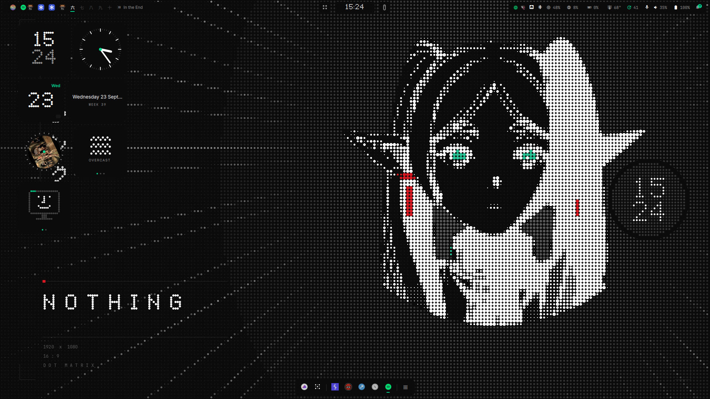
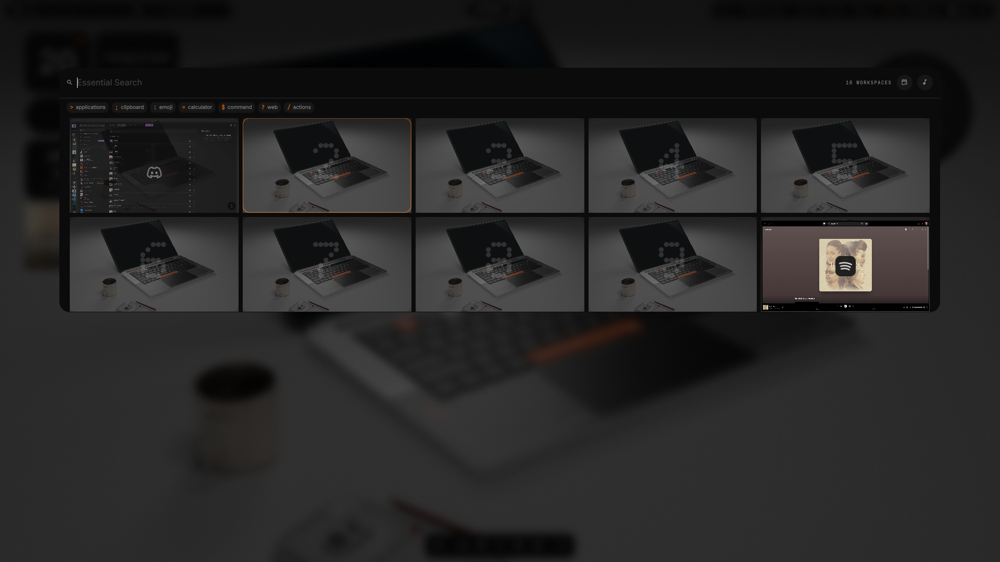
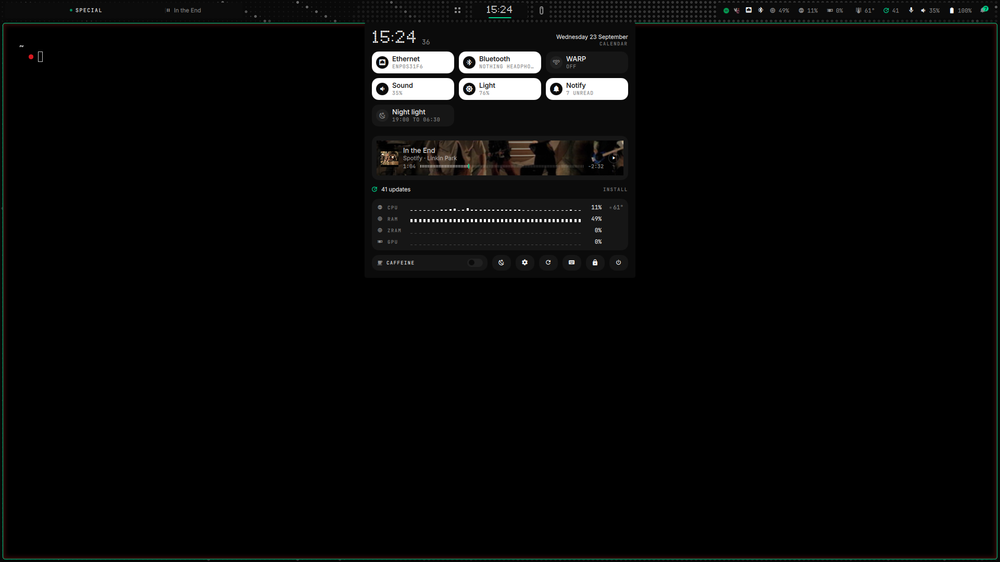
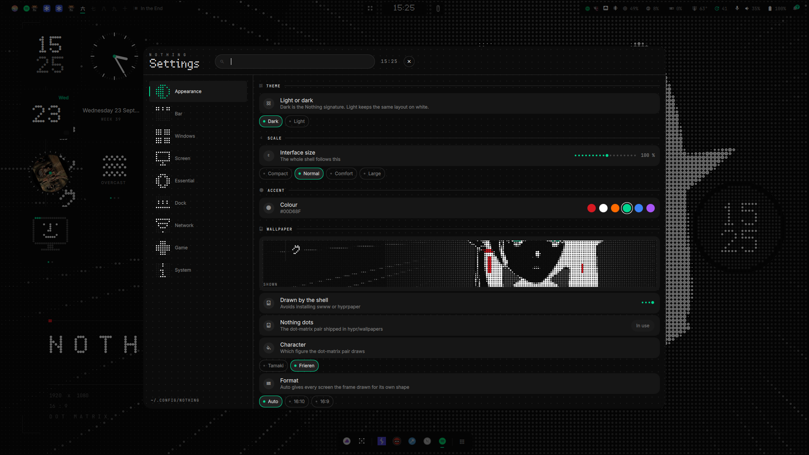
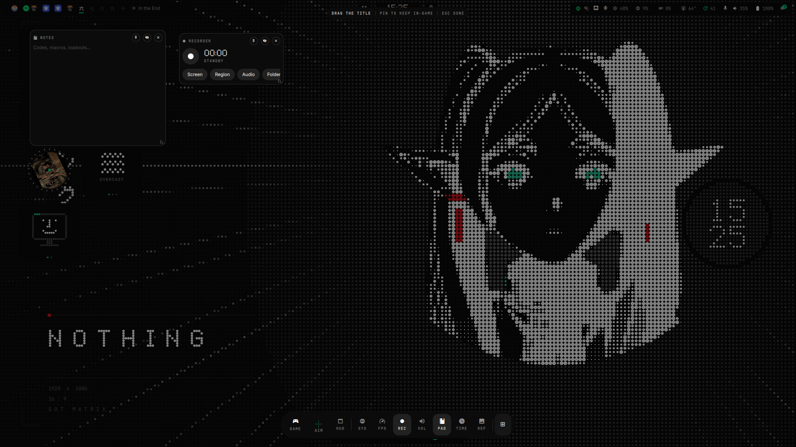
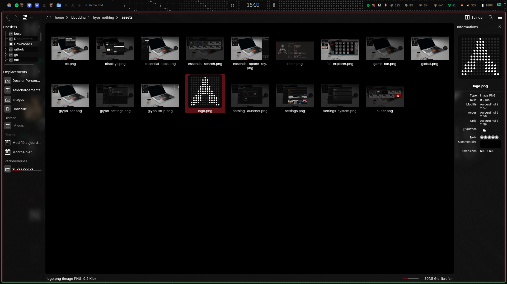
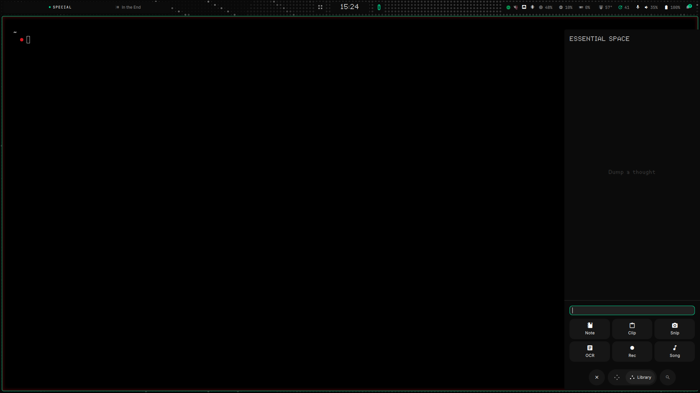

# Nothing

Hyprland + Quickshell rice inspired by **Nothing OS**: matte black,
concrete grey, red `#d71921`, tight radii, Ndot, and a Glyph Matrix.

Unofficial. Not affiliated with Nothing Technology Limited.

Written for **Arch / EndeavourOS**, **Hyprland ≥ 0.56** (Lua config) and
**Quickshell 0.2**.

## Screenshots

| Desktop | Launcher (`Essential Search`) |
|:---:|:---:|
|  |  |
| **Control centre** | **Settings** |
|  |  |
| **Game bar** | **Dolphin** |
|  |  |
| **Essential Space + Key |
|  |

## Install

```bash
git clone https://github.com/<you>/nothing.git
cd nothing
./install
```

That writes the rice into **your** config dirs as **copies** (rsync/cp,
no symlinks):

| Path | From |
|---|---|
| `~/.config/hypr/hyprland.lua` | `hypr/hyprland.lua` (loader) |
| `~/.config/hypr/hyprland/` | env, keybinds, rules, … |
| `~/.config/hypr/wallpaper.png` | `hypr/wallpaper.png` (default wallpaper) |
| `~/.config/hypr/hypridle.conf` | idle |
| `~/.config/hypr/hyprlock.conf` | lock |
| `~/.config/quickshell/nothing/` | the shell |
| `~/.config/scripts/` | helpers |
| `~/.config/theme/` | Dolphin / GTK / portal seeds |
| `~/.config/kitty/` | terminal (Nothing colours) |
| `~/.config/fish/conf.d/nothing.fish` | greeting, starship, aliases |
| `~/.config/starship.toml` | prompt |
| `~/.config/fastfetch/` | fetch |
| `~/.config/mpv/` | player |
| `~/.config/fontconfig/` | Inter / JetBrains, greyscale AA |
| `~/.config/hypr/custom.lua` | your binds (created once) |

Whatever was already there is moved to `*.bak-<date>`. After a `git pull`,
run `./install --files` again to refresh the copies. The installer also
applies the Dolphin/GTK theme, file-picker portals, and an SDDM session
named **Nothing** with the **astronaut** greeter (Hyprland Kath). Log out
and pick it (or the normal Hyprland entry: it now reads the same
`hyprland.lua`).

| Flag | What it does |
|---|---|
| *(none)* | packages + `~/.config` + SDDM |
| `--deps` | packages only |
| `--files` | `~/.config` + theme, skip pacman |
| `--uninstall` | restore the backups (not packages) |
| `--noconfirm` | no prompts |

Needs `sudo` for packages and the session file. Do not run the script
itself as root.

Without SDDM, from a TTY:

```bash
./scripts/nothing-session.sh
```

`SUPER+SHIFT+M` leaves that session.

### Nested (dev)

```bash
./scripts/run-nested.sh
```

The host compositor eats `SUPER`. Optional passthrough: source
`hypr/passthrough.lua` in the host config, then `SUPER+ALT+P`.

### Shell only

```bash
./scripts/run-shell.sh          # overlay on the current session
./scripts/run-shell.sh --solo   # pause an illogical-impulse shell
```

## What you get

- **Bar, dock, control centre, settings** - one scale slider, one accent
- **Launcher** (`SUPER`) - search on top, 10-workspace overview under it
- **Glyph Matrix** - 25×25 disc on the desktop (clock, battery, dice, cava…)
- **Game bar** (`SUPER+G`) - overlay widgets you pin over a game
- **Screenshots** - click a window, drag a rect, or click empty for the output
- Notifications with an **Open message** action for Vesktop / Discord
- Optional **WARP** (1.1.1.1) tile in the control centre if `warp-cli` is
  installed - `./install` offers the AUR package `cloudflare-warp-bin`
- Dolphin / GTK / Qt themed to match; file pickers go through xdg-desktop-portal
- **kitty**, **fish** + starship, **fastfetch**, **mpv**, and **fontconfig** (which fonts apps pick, and greyscale anti-aliasing)

Settings live in `~/.config/nothing/config.json`.

## Shortcuts

| Keys | Action |
|---|---|
| `SUPER` (tap) | launcher + workspaces |
| `SUPER+Enter` / `SUPER+T` | terminal |
| `SUPER+E` | file manager |
| `SUPER+W` | browser |
| `SUPER+D` / `SUPER+F` | maximise / fullscreen |
| `SUPER+N` | control centre |
| `SUPER+B` | notifications |
| `SUPER+I` | settings |
| `SUPER+G` | game bar |
| `SUPER+V` / `SUPER+.` | clipboard / emoji |
| `SUPER+SHIFT+S` | region capture |
| `SUPER+SHIFT+X` | OCR |
| `SUPER+SHIFT+R` | record a region |
| `SUPER+Esc` | session menu |
| `SUPER+L` | lock |

Apps (terminal, browser, editor) are detected among what is installed.

Stock binds: `hypr/hyprland/keybinds.lua`. Personal ones go in
`~/.config/hypr/custom.lua` (created on install). Throwaway tests:
`~/.config/hypr/local.lua`.

## Fonts

```bash
yay -S ttf-nothing-font-git    # Ndot77 + Inter - pulled by ./install
```

Without that package the UI still runs, on system fonts.

## Uninstall

```bash
./install --uninstall
```

Packages are left installed. App theme revert:

```bash
./scripts/apply-app-theme.sh --revert
```

## Credits

- [Nothing OS](https://nothing.tech) for the language (again: unofficial)
- [end-4 / illogical-impulse](https://github.com/end-4/dots-hyprland) -
  that was my daily rice. I got used to a handful of its behaviours, and
  those habits steered the direction Nothing took.
- [Quickshell](https://quickshell.outfoxxed.me/)
- [Lawnicons](https://github.com/LawnchairLauncher/lawnicons) (Apache-2.0)

Internals (file map, Hyprland Lua notes): [docs/internals.md](docs/internals.md).
